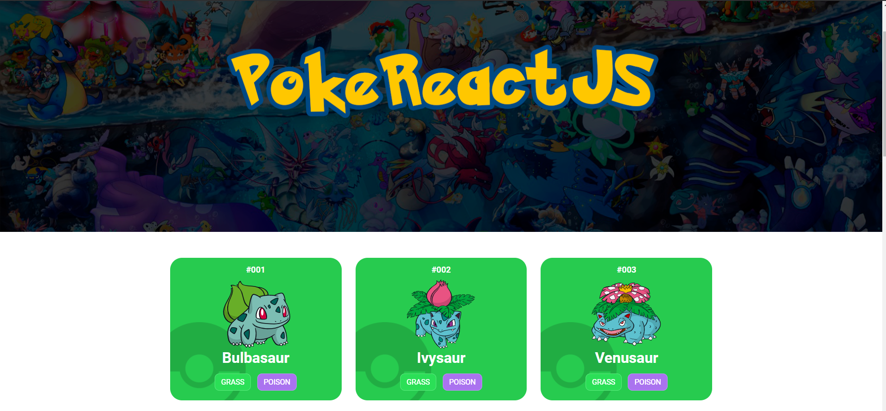

# PokeReactJS

<!---Esses são exemplos. Veja https://shields.io para outras pessoas ou para personalizar este conjunto de escudos. Você pode querer incluir dependências, status do projeto e informações de licença aqui--->




> Projeto simples utilizando ReactJS, Axios, StyledComponents para consumo de uma API pública para listar 20 Pokémons na página em ordem numérica.

### Ajustes e melhorias

O projeto ainda está em desenvolvimento e as próximas atualizações serão voltadas nas seguintes tarefas:

- [X] Input para filtrar os Pokémon
- [X] Paginação
- [X] Routes para cada Pokémon com informações adicionais sobre o mesmo


## 💻 Pré-requisitos

Antes de começar, verifique se você atendeu aos seguintes requisitos:
<!---Estes são apenas requisitos de exemplo. Adicionar, duplicar ou remover conforme necessário--->
* Você instalou a versão mais recente de `ReactJS, nodeJS`
* Você tem uma máquina `Windows, Linux ou Mac`.

## 🚀 Instalando PokeReactJS

Para instalar o PokeReactJS, siga estas etapas:

Linux e macOS:
```
cd poke-reactjs

npm install OU yarn
```

Windows:
```
cd poke-reactjs

npm install OU yarn
```

## ☕ Usando PokeReactJS

Para usar search.Github, basta apenas:

```
Navegar pelo site e caso queira visualizar mais 20 Pokémon, clique em CARREGAR MAIS localizado no rodapé da página.
```

[⬆ Voltar ao topo](#poke-reactjs)<br>
